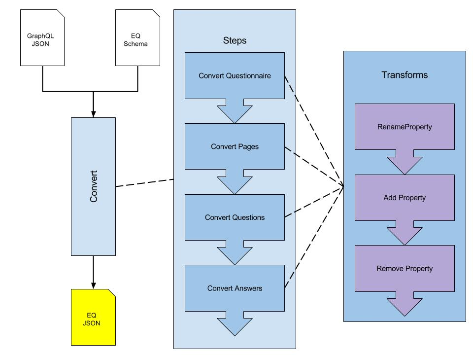

# eq-publisher
An API for publishing [eq-author](http://github.com/ONSDigital/eq-author) questionnaires.

## Oveview

The conversion between the GraphQL JSON output and the EQ runner schema can be thought of as a pipeline.

The conversion pipeline is made up of a series of steps to convert each part of the GraphQL JSON.

Each step applies a series of transforms to manipulate the resulting JSON.



## Installation

To install dependencies, simply run:
```
yarn install
```

To run the application:
```
yarn start
```

## Testing

To run all tests:
```
yarn test
```

## Routes

By default, the express server will bind to port `9000`. 

You can then navigate to [http://localhost:9000](http://localhost:9000).

Since the API is still under active development, there are only two routes at present:

| Route  | Description |
| ------------- | ------------- |
| [/mock/graphql/:questionaireId](http://localhost:9000/mock/graphql/1)  | Demonstrates the JSON that is output by the Author API.  |
| [/mock/publish/:questionaireId](http://localhost:9000/mock/graphql/1)  | Demonstrates the published EQ JSON.  |
