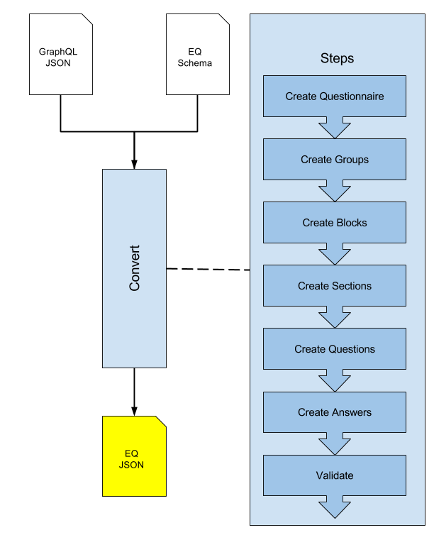

# eq-publisher
An API for publishing [eq-author](http://github.com/ONSDigital/eq-author) questionnaires.

## Oveview

The conversion between the GraphQL JSON output and the EQ runner schema can be thought of as a pipeline.

The conversion pipeline is made up of a series of steps to convert each part of the GraphQL JSON.

Each step applies a series of transforms to manipulate the resulting JSON.




## Running with Docker Compose

For convenience, a `docker-compose.yml` configuration is supplied with this project.
The compose file orchestrates the Publisher application and the EQ schema validation service.
A benefit of this approach is that there is no need to run the schema validation service manually.
Using Docker Compose the application can be run using the following command:

```bash
docker-compose up --build
```

**Note that the `--build` flag is only required on first run.**


## Running the service manually

### Installation

To install dependencies, simply run:
```
yarn install
```

### Starting the application

To run the application:
```
yarn start
```

**Note that some [configuration](#configuration) may be necessary to run the service in isolation**

## Testing

To run all tests:
```
yarn test
```

## Configuration

The following environment variables can be configured.

| Name | Description | Required |
| --- | --- | --- |
| `EQ_SCHEMA_VALIDATOR_URL` | The URL of the schema validation service. See [Running with Docker Compose](#running-with-docker-compose). | Yes |
| `EQ_AUTHOR_API_URL` | The URL of the GraphQL API server. If not supplied, mock API will be used. | No |

## Routes

By default, the express server will bind to port `9000`. 

You can then navigate to [http://localhost:9000](http://localhost:9000).

Since the API is still under active development, there are only two routes at present:

| Route  | Description |
| ------------- | ------------- |
| [/graphql/:questionaireId](http://localhost:9000/graphql/1)  | Demonstrates the JSON that is output by the Author API.  |
| [/publish/:questionaireId](http://localhost:9000/publish/1)  | Demonstrates the published EQ JSON.  |
